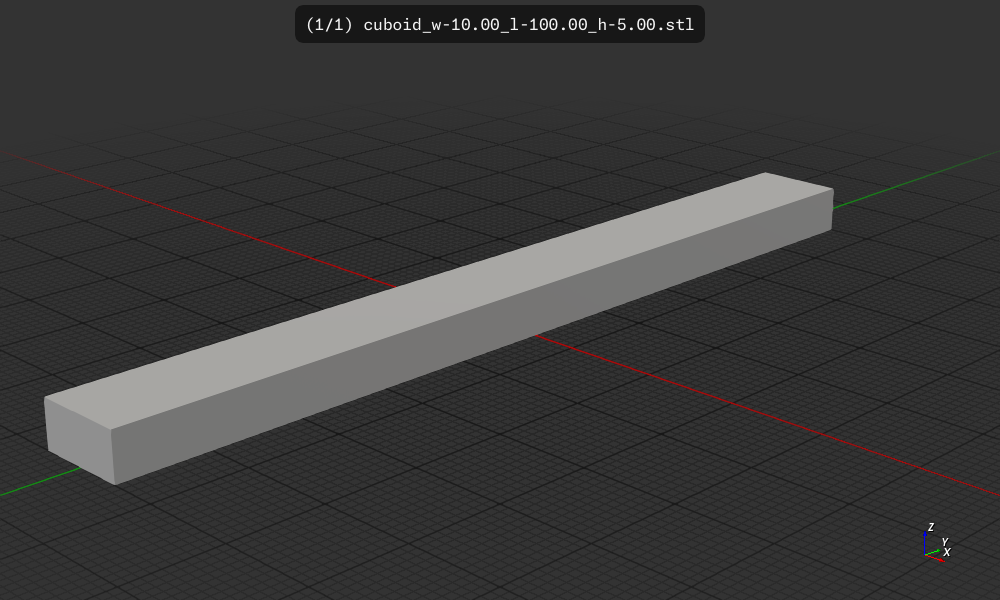

# cuboid

Create a cuboid with specified dimensions in csgrs
Optionally it attempts to generate walls and infill
using gyroid infill.

Here are the stl files the filename has the parameters used to generate it:
 * cuboid_w-40.00_l-40.00_h-40.00_t-4.00_r-50_p-2.00_i-0.00_I-Outside.stl
 * cuboid_w-40.00_l-40.00_h-40.00_t-4.00_r-50_p-2.00_i-0.00_I-Inside.stl
 * cuboid_w-40.00_l-40.00_h-40.00_t-4.00_r-50_p-2.00_i-0.00_I-Center.stl

This is the 3mf file generated by prusa-slicer for all three of the above imported:
 * cuboid_w-40.00_l-40.00_h-40.00_t-4.00_r-50_p-2.00_i-0.00_ICO.3mf

Not great results, but interesting.

Conclusion, just let prusa-slicer generate the walls and infill although
I need to generate walls with holes and attachments and see how
prusah-slicer handles that, but I'm guessing it will work.

## Usage

```
$ cuboid -H
   Compiling panel v0.1.0 (/home/wink/data/3D-Graphics-CAD-CAM/Prusa/models/panel)
    Finished `dev` profile [unoptimized + debuginfo] target(s) in 1.95s
     Running `target/debug/panel -H`
Usage: panel [OPTIONS]

Options:
  -H, --help             Prints help information
  -w, --width <WIDTH>    width of the panel [default: 10.0]
  -l, --length <LENGTH>  length of the panel [default: 100.0]
  -h, --height <HEIGHT>  height of the panel [default: 5.0]
  -V, --version          Print version
```

## Build, run, install

```
$ cargo build
    Finished `dev` profile [unoptimized + debuginfo] target(s) in 0.09s
$ cargo run
    Finished `dev` profile [unoptimized + debuginfo] target(s) in 0.07s
     Running `target/debug/cuboid`
$ cargo install --path .
  Installing cuboid v0.1.0 (<snipped>)
    Updating crates.io index
     Locking 229 packages to latest Rust 1.88.0 compatible versions
      Adding i_float v1.6.0 (available: v1.15.0)
      Adding i_overlay v1.9.4 (available: v1.10.0)
      Adding i_shape v1.6.0 (available: v1.14.0)
    Finished `release` profile [optimized] target(s) in 0.86s
   Replacing /home/wink/.cargo/bin/cuboid
   Replaced package `cuboid v0.1.0 (<snipped>)` with `cuboid v0.1.0 (<snipped>)` (executable `cuboid`)
```

## Results

The default output file is `cuboid_w-10.00_l-100.00_h-5.00.stl`

This can be visualized as a 3D model using `f3d cuboid_w-10.00_l-100.00_h-5.00.stl`
and converted to an image using `f3d cuboid_w-10.00_l-100.00_h-5.00.stl --output cuboid_w-10.00_l-100.00_h-5.00.png`

#

## License

Licensed under either of

- Apache License, Version 2.0 ([LICENSE-APACHE](LICENSE-APACHE) or http://apache.org/licenses/LICENSE-2.0)
- MIT license ([LICENSE-MIT](LICENSE-MIT) or http://opensource.org/licenses/MIT)

### Contribution

Unless you explicitly state otherwise, any contribution intentionally submitted
for inclusion in the work by you, as defined in the Apache-2.0 license, shall
be dual licensed as above, without any additional terms or conditions.
